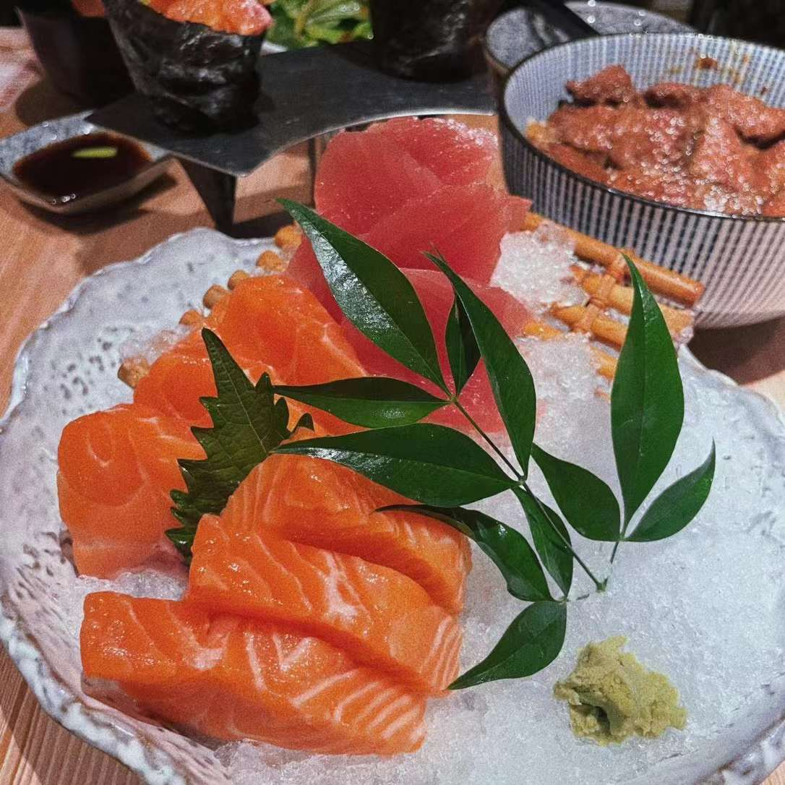
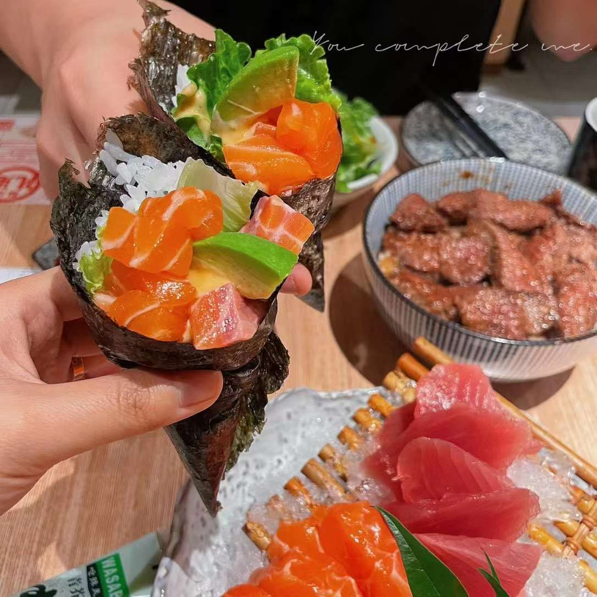
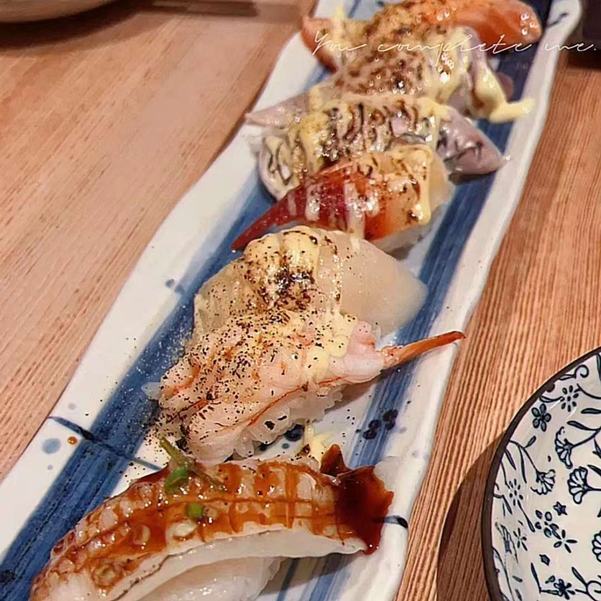

- Address
	- 📍上海市浦东新区张杨路500号华润时代广场6层L618号
- Recommendation
	- ⭐️⭐️⭐️⭐️
- Commentary
	- 下班去吃已经八点，人还是很多，可以大众点评取号，过去等了几分钟就进去了。
	- 味道非常好，性价比超高。牛排饭非常好吃，肉很厚，也不是很难嚼，汤汁拌一下饭特别香。三文鱼和金枪鱼都是厚切，很新鲜，媳妇很喜欢。七贯寿司每个都不一样，推荐。一来就看到隔壁桌在吃牛油果三文鱼手卷，非常有食欲，造型好看也好吃。本来以为不是很够，结果吃到扶墙出。经常打卡，还会再来。
- Order (💰213 CNY)
	- 三文鱼 💰39
	- 金枪鱼 💰35
	- 牛排饭 💰58
	- 文火七贯寿司 💰45
	- 牛油果三文鱼手卷 💰36
- Picture
	- 
	- 
	- 

